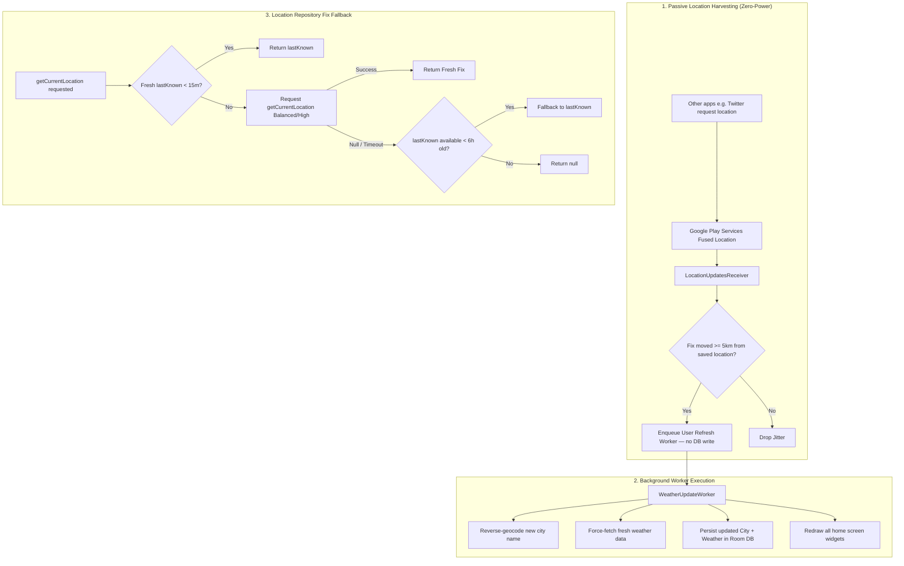

# Dynamic Current-Location Widget Following

**Date:** 2026-08-13
**Status:** In Progress

## Background

When a user travels to another city while using other applications (such as Twitter/X or Google Maps) and subsequently returns to their Android home screen to check the Clock & Weather widget, the widget could still display the previous city (e.g. London) and its weather readings.

Desired behavior:
- The widget should automatically follow the user to their new city.
- Location changes detected by the OS while the user is inside other apps should be captured passively with zero battery overhead.
- When an active location fix times out (such as indoors), the system must fallback to recent last-known fixes (within 6 hours) rather than failing silently with null.
- Reverse geocoding and network fetches must stay in WorkManager workers to prevent BroadcastReceiver ANRs.
- Home screen widget rendering must stay fast and offline-first from the Room cache without blocking on GPS fixes.

---

## Refined Architecture & Decisions

### Architectural Decisions:
1. **`minUpdateDistanceMeters = 5000f`:** Aligned with `WeatherRefreshLocationResolver.SIGNIFICANT_MOVE_METERS` (5 km). Avoids waking the application process for minor displacements that do not alter weather grid predictions.
2. **`PendingIntent.FLAG_MUTABLE`:** Required on Android 12+ (API 31+) so Google Play Services can populate `LocationResult` in the callback intent.
3. **Keep `ExistingWorkPolicy.KEEP` in `scheduleImmediateRefresh`:** Prevents rapid screen unlocks (`SCREEN_ON`, `USER_PRESENT`) from continuously aborting in-flight refreshes. Passive location events use `scheduleUserRefresh` under a separate unique work name.
4. **No active GPS on widget draw path:** `BaseWidgetUpdater` remains strictly cache-backed for instant, flicker-free rendering.
5. **No network calls — and no writes — in `BroadcastReceiver`:** `LocationUpdatesReceiver` detects the move and delegates the entire update to `WeatherUpdateWorker`. Persisting coordinates alone would leave the row naming one city while pointing at another whenever the worker's own fix comes back null; the name and coordinates change together or not at all. The worker reads the same fix via `lastLocation`, which is still fresh.
6. **Bounded 6-hour ceiling on `lastKnown` fallback:** Eliminates stale "ghost" fixes while providing high resilience indoors or during flights/train rides.

---

## Implementation Steps

1. **`WeatherRefreshLocationResolver`**:
   - Ensure relocation distance calculation and move thresholds are unified and reusable across the repository, worker, and receiver.

2. **`LocationRepositoryImpl`**:
   - Update `getCurrentLocation()`: if active fixes return null/time out, check if `lastKnown` is available and < 6 hours old before returning null.

3. **`PassiveLocationManager`**:
   - Create manager to register/unregister `Priority.PRIORITY_PASSIVE` requests with `minUpdateDistanceMeters = 5000f`.
   - Use `PendingIntent.FLAG_MUTABLE` on API 31+.
   - Require the background grant, not just foreground: `PRIORITY_PASSIVE` is still gated by "Allow all the time" on Android 10+, so registering without it reports success and never fires. Guard `SecurityException` too.

4. **`LocationUpdatesReceiver`**:
   - Handle incoming `LocationResult` broadcasts.
   - Detect significant moves (>= 5 km) from the saved `isCurrentLocation`.
   - Invoke `WeatherUpdateScheduler.scheduleUserRefresh(context)` and write nothing itself.
   - Bound the handler with `withTimeout` inside the receiver's ~10s budget, since `goAsync()` holds the broadcast open until `finish()`.

5. **Lifecycle Integration**:
   - Register receiver in `AndroidManifest.xml` (`android:exported="false"`).
   - Hook registration in `ClockWeatherApplication.onCreate()`, `BaseWidgetProvider.onEnabled()`, `BootCompletedReceiver`.
   - Hook unregistration in `BaseWidgetProvider.onDisabled()`.

6. **Testing & Verification**:
   - Unit tests for 6-hour bounded `lastKnown` fallback in `LocationRepositoryImpl`.
   - Unit & Robolectric tests for `LocationUpdatesReceiver` and `PassiveLocationManager`.
   - Full test suite run with JDK 21 (`$env:JAVA_HOME="C:\Program Files\Java\jdk-21.0.10"; ./gradlew test`).
